# Agentic AI Workflow Documentation
### Customer Retention Strategy Assistant — Powered by LangGraph

This document provides a technical breakdown of the architectural workflow used in the Customer Churn Intelligence system. The project utilizes a directed acyclic graph (DAG) implemented via **LangGraph** to ensure stateful, modular, and explainable AI reasoning.

---

## 🏗 System Architecture Diagram

---

## 🧩 Architectural Components

### 1. Unified Agent State (`AgentState`)
The system maintains an explicit state object throughout the lifecycle of a request:
- `customer_data`: Raw input attributes.
- `prediction`: Results from the XGBoost classifier (Label & Probability).
- `explanation`: Feature importance rankings from SHAP.
- `strategies`: Best practices retrieved from the semantic vector store.
- `final_output`: The synthesized human-readable report.

### 2. The Execution Nodes

| Node | Purpose | Technical Tooling |
| :--- | :--- | :--- |
| **Predict** | Determines if the customer is likely to churn. | XGBoost Pipeline (`models/churn_pipeline.pkl`) |
| **Explain** | Identifies the WHY behind the prediction. | **SHAP** TreeExplainer |
| **RAG** | Retrieves specific retention strategies. | **FAISS** + HuggingFace Embeddings |
| **Synthesis** | Generates the final multi-section report. | **Groq LLaMA 3.3 70B** |

### 3. RAG implementation (Retrieval-Augmented Generation)
The project identifies the "Top Driver" from the SHAP analysis and uses it as a semantic query against a FAISS vector store. 
- **Knowledge Source**: `src/retention_kb.py`
- **Vector Store**: FAISS (Facebook AI Similarity Search).
- **Embeddings**: `all-MiniLM-L6-v2`
- **Benefit**: Instead of generic advice, the agent provides interventions specifically matched to whether the customer is unhappy with service, pricing, or distance.

### 4. Dynamic Reporting Logic
The `synthesis_node` uses a conditional reasoning loop:
- **If Safe**: It generates **"Retention Drivers"** to reinforce loyalty.
- **If At Risk**: It generates **"Risk Factors"** to trigger recovery.

---

## 📈 Technical Sophistication Summary
By moving from a simple if-else script to a **LangGraph State Machine**, the system achieves:
1. **Explainability**: Using SHAP to ground agent reasoning in data.
2. **Reduced Hallucination**: RAG ensures recommendations are based on verified retention strategies.
3. **Modularity**: Individual nodes can be updated or replaced without breaking the entire pipeline.
