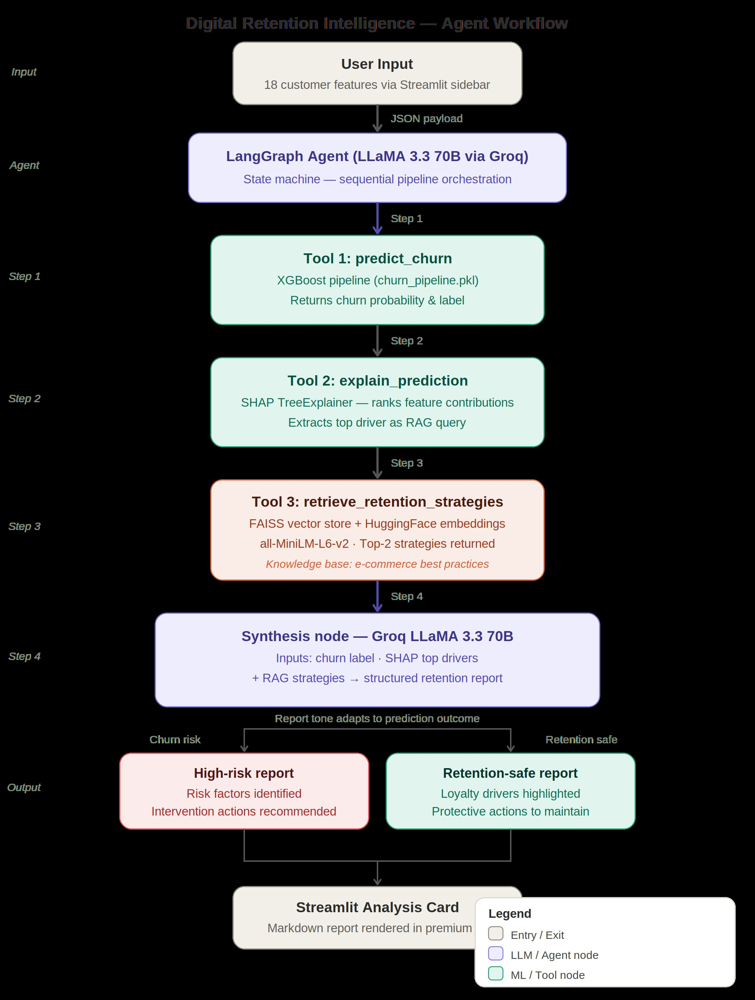

# Telecom Retention Intelligence: Agentic AI Churn Strategy
### Gen AI Capstone Project — Milestone 2 (End-Sem Submission)

This project represents the evolution of a standard machine learning classifier into a sophisticated **Telecom Retention Strategy Assistant**. By leveraging **LangGraph** for workflow orchestration and **RAG (Retrieval-Augmented Generation)** for strategy lookup, the system doesn't just predict *who* will leave — it reasons about *why* and retrieves *exactly* how to save them on the network.

---

## 🏛 Project Evolution: From Prediction to Strategy
| Phase | Focus | Technology | Milestone |
| :--- | :--- | :--- | :--- |
| **Milestone 1** | Predictive Modeling | XGBoost, Scikit-learn, EDA | Mid-Sem |
| **Milestone 2** | **Agentic Strategy** | **LangGraph, RAG (FAISS), SHAP, Groq LLaMA 3.3** | **End-Sem** |

---

## 🧠 System Architecture & Workflow


The heart of this project is a multi-node **LangGraph State Machine** that executes an autonomous reasoning loop.

### The Reasoning Workflow (LangGraph)
1.  **Prediction Node**: Accepts raw customer data and invokes the trained **XGBoost Pipeline** to determine churn probability and label.
2.  **Explanation Node (SHAP)**: Autonomously triggers a **SHAP (SHapley Additive exPlanations)** analysis to identify the top 3 drivers (features) pushing the customer toward or away from churn.
3.  **RAG Retrieval Node**: Takes the primary risk factors identified by SHAP and queries a **FAISS Vector Store** initialized with **Telecommunications retention best practices** to find relevant interventions.
4.  **Synthesis Node**: A **Groq-powered LLM** (LLaMA 3.3 70B) synthesizes the prediction, SHAP drivers, and RAG strategies into a professional, structured **Telecom Retention Report**.

---

## 🚀 Key Technical Features

### 1. Agentic Orchestration (LangGraph)
Unlike linear scripts, this system uses a formal **State Graph** to manage memory and transitions between nodes. This ensures explicit state management and modularity, as required for Milestone 2.

### 2. RAG-Powered Decisions (FAISS + HuggingFace)
We implemented a **Retrieval-Augmented Generation (RAG)** system using:
- **Knowledge Base**: A curated collection of professional **telecom network & contract retention** strategies.
- **Embeddings**: `sentence-transformers/all-MiniLM-L6-v2` for semantic search.
- **Vector DB**: In-memory **FAISS** for millisecond retrieval of strategies based on the identified risk profile.

### 3. Model Explainability (SHAP)
To eliminate the "Black Box" nature of AI, we integrated **SHAP TreeExplainers**. This allows the agent to precisely pinpoint which features (e.g., `SatisfactionScore`, `CashbackAmount`) are the primary churn catalysts for a specific individual.

### 4. Professional Synthesis
The agent dynamically adjusts its reporting tone:
- **Churn Risk**: Focuses on "Risk Factors" and "Recovery Actions."
- **Retention Safe**: Focuses on "Retention Drivers" and "Protective Actions" to maintain loyalty.

---

## 🛠 Tech Stack
- **AI/LLM**: Groq (LLaMA 3.3 70B), LangChain, LangGraph.
- **ML/Analytics**: Scikit-Learn, XGBoost, SHAP, Pandas.
- **Vector DB**: FAISS, HuggingFace Embeddings.
- **Frontend**: Streamlit (Premium UI layout).
- **Environment**: Python 3.11/3.12.

---

## 📂 Project Structure
```text
gen_ai_capstone_project/
├── app.py                # Main Entry Point
├── data/                 # Raw/Processed Data (Telecom Dataset)
├── notebooks/            # Research & EDA (Jupyter Notebooks)
├── models/               # Trained Models (XGBoost Pipeline)
├── src/                  # Source Code (LangGraph & Logic)
├── tools/                # Agentic Tools (Predict, Explain, RAG)
├── requirements.txt      # Dependency specification
└── README.md             # Project Documentation
```

---

## 🧑‍💻 Getting Started

### 1. Clone & Install
```bash
git clone <your-repo-url>
pip install -r requirements.txt
```

### 2. Configure Environment
Create a `.env` file or provide via Streamlit Secrets:
```text
GROQ_API_KEY=your_key_here
```

### 3. Launch Application
```bash
streamlit run app.py
```

---

## 👥 Team Members
| Name | Enrollment No. | Role |
| :--- | :--- | :--- |
| **Rudraksh Sharma** | 2401010395 | XGBoost Modeling, Model Evaluation, Groq LLM Integration, Deployment (Docker) |
| **Bineet Keshari** | 2401010130 | SHAP Explainability, Feature Contribution Analysis, LangGraph Node Design, Prompt Engineering |
| **Vridhi Chaudhary** | 2401010336 | RAG System, FAISS Vector Store, Knowledge Base Curation, Embedding & Retrieval Pipeline |
| **Anshuman Mehta** | 2401010082 | System Architecture, LangGraph Integration, Frontend Dashboard (Streamlit), Deployment Setup |

